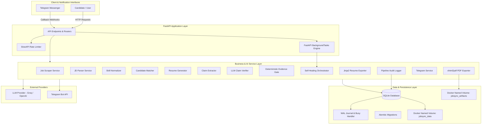
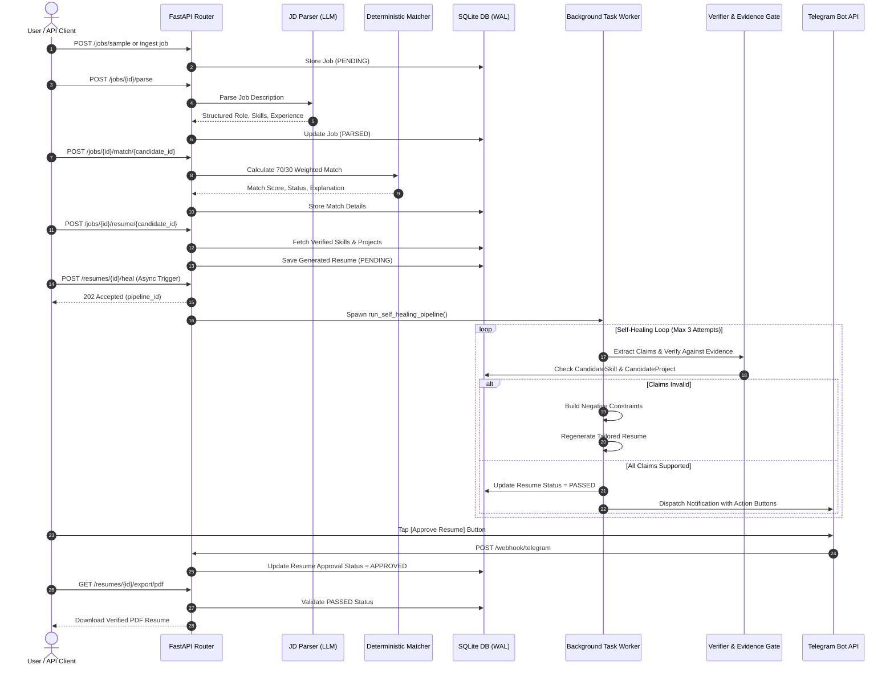
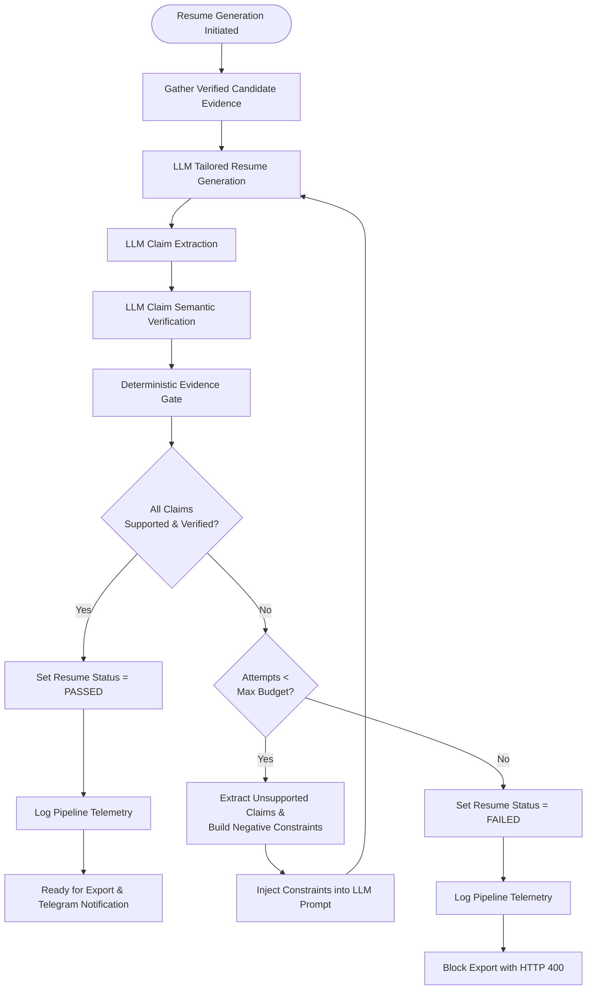
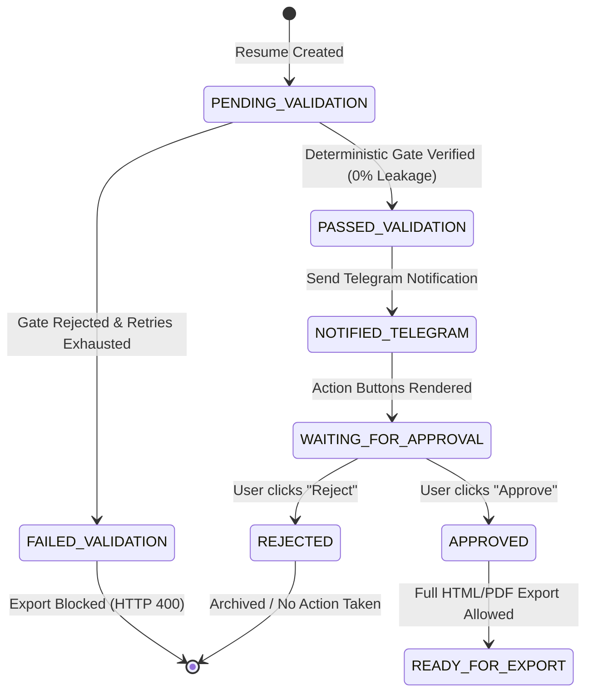
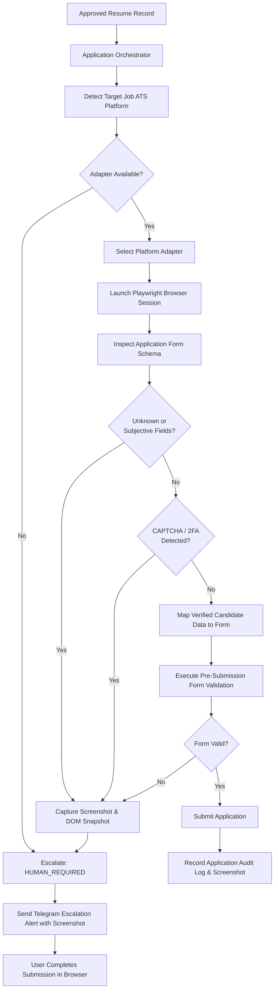
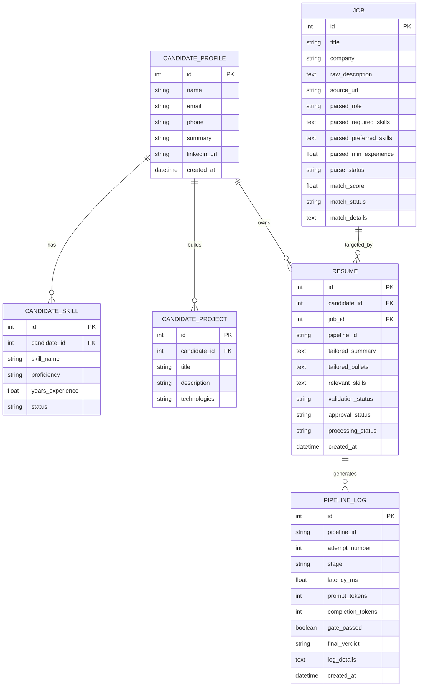

# JobSync Copilot

JobSync Copilot is a privacy-first, single-user AI-assisted job application preparation system designed to automate the repetitive aspects of the job search lifecycle while enforcing strict factual accuracy, database-grounded evidence verification, and deterministic human-in-the-loop approval.

The system ingests and analyzes job postings, extracts structured requirements from job descriptions, normalizes skills against alias taxonomies, performs weighted deterministic matching against verified candidate profiles, generates tailored resumes, validates every individual claim against database-backed evidence, and automatically self-heals hallucinations before permitting final export.

---

## Table of Contents

- [Project Overview](#project-overview)
- [Problem Statement](#problem-statement)
- [Goals and Non-Goals](#goals-and-non-goals)
- [Current Implementation Status](#current-implementation-status)
- [System Architecture](#system-architecture)
- [End-to-End Workflow](#end-to-end-workflow)
- [Resume Generation, Verification, and Self-Healing](#resume-generation-verification-and-self-healing)
- [Human-in-the-Loop Approval Workflow](#human-in-the-loop-approval-workflow)
- [Telemetry, Audit Logging, and Metrics](#telemetry-audit-logging-and-metrics)
- [Planned Application Automation Architecture](#planned-application-automation-architecture)
- [Technology Stack](#technology-stack)
- [Project Structure](#project-structure)
- [Security, Concurrency, and Reliability](#security-concurrency-and-reliability)
- [Database Schema and Alembic Migrations](#database-schema-and-alembic-migrations)
- [Testing and Empirical Evaluation Suite](#testing-and-empirical-evaluation-suite)
- [Dockerization and Deployment](#dockerization-and-deployment)
- [Configuration Reference](#configuration-reference)
- [Running the Project](#running-the-project)
- [Current Limitations](#current-limitations)
- [Future Roadmap](#future-roadmap)
- [License](#license)

---

## Project Overview

JobSync Copilot is architected around one foundational principle:

> **AI can interpret and generate language, but deterministic systems must decide what information is permitted to leave the system.**

Large Language Models (LLMs) frequently hallucinate unearned qualifications when prompted to tailor resumes for competitive job descriptions. JobSync Copilot prevents hallucination leakage by treating verified candidate records (skills and projects) as the immutable single source of truth.

A generated resume is never assumed to be factual merely because an LLM produced it. Every generated summary and bullet point is decomposed into individual factual claims, evaluated against candidate evidence by an LLM verifier, and verified by a **Deterministic Evidence Gate** that queries the underlying database. If any claim fails validation, the system enters an automated **Self-Healing Loop** that injects explicit negative rejection constraints back into the prompt for regeneration.


---

## Problem Statement

Traditional job application workflows involve substantial repetitive friction:
- Ingesting, cleaning, and extracting requirements from unstructured job descriptions.
- Reconciling skill variations, acronyms, and synonyms across technical domains.
- Calculating precise, objective qualification overlap.
- Manually customizing resume summaries and project bullet points for every target role.
- Preventing accidental embellishments or unsupported claims from entering application materials.
- Tracking application states and managing human reviews across distributed channels.

Unrestricted generative AI introduces severe risks of **hallucinated claims** (e.g., claiming production Kubernetes expertise when the candidate has only worked with Docker). JobSync Copilot resolves this problem by separating:
1. **Candidate Evidence Ingestion**: Immutable database records for skills and projects.
2. **Generation**: LLM-driven role tailoring.
3. **Decomposition**: Automated claim extraction from generated text.
4. **Verification**: LLM semantic verification against provided evidence context.
5. **Deterministic Validation**: Strict SQL-level citation cross-referencing and verification status gating.
6. **Export and Dispatch**: Strict gating that rejects unvalidated or failed resumes.

---

## Goals and Non-Goals

### Primary Goals
- Automate repetitive job discovery, parsing, and tailoring tasks.
- Keep candidate data strictly private, local, and user-controlled.
- Ground all generated resume claims strictly in verified database records.
- Enforce 0.0% hallucination leakage via a deterministic evidence verification gate.
- Provide asynchronous background self-healing for multi-attempt resume regeneration.
- Provide interactive Telegram Bot notifications with one-tap approval and rejection actions.
- Maintain comprehensive execution logs, token usage tracking, and latency metrics per pipeline run.
- Provide containerized multi-service deployment with Docker Compose, named volumes, SQLite WAL concurrency, and GitHub Actions CI.
- Protect expensive endpoints with in-memory rate limiting.

### Non-Goals
- Functioning as an unrestricted, multi-tenant commercial SaaS platform.
- Scraping arbitrary commercial job boards without respecting anti-bot constraints or Terms of Service.
- Bypassing CAPTCHA challenges or anti-bot defenses automatically.
- Submitting applications autonomously without explicit, deterministic human approval.
- Relying on raw LLM outputs as trusted candidate facts without database verification.

---

## Current Implementation Status

| Component | Status | Implementation Details |
| :--- | :--- | :--- |
| **FastAPI Core Application** | Implemented | RESTful API, lifespan event handlers, modular service dependencies. |
| **SQLite with WAL Mode** | Implemented | `PRAGMA journal_mode=WAL`, `busy_timeout=10000`, 10s connection timeout. |
| **SQLAlchemy 2.0 ORM** | Implemented | Relational models for `CandidateProfile`, `CandidateSkill`, `CandidateProject`, `Job`, `Resume`, and `PipelineLog`. |
| **Alembic Database Migrations** | Implemented | Versioned migrations tracking schema evolution (`alembic/versions/`). |
| **Candidate Management** | Implemented | CRUD endpoints, verified/unverified skill flags, verified project catalog. |
| **Job Description Parsing** | Implemented | Structured LLM extraction of required/preferred skills and experience. |
| **Skill Normalization** | Implemented | Deterministic dictionary and regex normalization across 30+ technical aliases. |
| **Candidate-Job Matcher** | Implemented | Weighted deterministic scoring model (70% Required / 30% Preferred skills). |
| **Tailored Resume Generator** | Implemented | Grounded resume generation restricted strictly to verified candidate evidence. |
| **Claim Extraction Engine** | Implemented | LLM-based decomposition of summaries and bullet points into discrete atomic claims. |
| **LLM Claim Verifier** | Implemented | Semantic evaluation mapping claims to evidence identifiers with verdict classification. |
| **Deterministic Evidence Gate** | Implemented | Python/SQL logic checking database verification status of cited evidence IDs. |
| **Asynchronous Self-Healing** | Implemented | Non-blocking background worker loop with negative constraint feedback and retry budgets. |
| **Export Safety Gate** | Implemented | HTTP 400 rejection on unverified or failed resumes; strict `PASSED` requirement. |
| **Jinja2 HTML Resume Export** | Implemented | Responsive, print-ready HTML resume styling. |
| **xhtml2pdf PDF Resume Export** | Implemented | Downloadable A4 PDF generation with clean print layouts. |
| **Telegram Bot Notifications** | Implemented | Async bot dispatch with inline action buttons for candidate review. |
| **Telegram Webhook Handling** | Implemented | Callback query handler updating resume approval state (`APPROVED` / `REJECTED`). |
| **Rate Limiting** | Implemented | `slowapi` in-memory rate limiter (5 req/min on heavy LLM endpoints). |
| **Telemetry & Pipeline Logs** | Implemented | Granular stage logging, latency tracking, token tracking, and leakage metrics. |
| **Multi-Container Dockerization** | Implemented | Multi-stage `Dockerfile`, `docker-compose.yml` (`api` + `worker`), named volumes. |
| **CI/CD Pipeline** | Implemented | GitHub Actions workflow executing tests, Alembic schema checks, and Docker builds. |
| **Automated Evaluation Suite** | Implemented | 21 empirical claim test cases calculating Accuracy, Precision, Recall, FPR, FNR. |
| **Automated ATS Submission** | Planned | Modular adapter interface for Greenhouse, Lever, and Workday. |
| **Playwright Browser Automation** | Planned | Headless browser form-filling with deterministic safety assertions. |
| **Human Takeover on Anomaly** | Planned | Screenshot-driven escalation on CAPTCHA, 2FA, or unknown fields. |

---

## System Architecture

JobSync Copilot is structured as a modular backend application with clear boundaries between API handling, business logic, deterministic validation, database persistence, and background tasks.



---

## End-to-End Workflow

The end-to-end processing lifecycle executes through sequential stages from initial ingestion to validated delivery:



---

## Resume Generation, Verification, and Self-Healing

Resume generation is governed by an adversarial multi-phase verification pipeline:



### Deterministic Evidence Gate Logic
The evidence gate enforces non-negotiable rules:
1. **Verification Requirement**: Evidence cited by the LLM must exist in the database under `CandidateSkill` or `CandidateProject` and must have `status == 'VERIFIED'`.
2. **Unsupported Citation Handling**: If the LLM marks a claim `UNSUPPORTED` or cites non-existent evidence IDs, the gate fails immediately.
3. **Exact ID Resolution**: Citations must resolve to valid database primary keys corresponding to the active candidate.

---

## Human-in-the-Loop Approval Workflow

JobSync Copilot integrates Telegram as an interactive approval interface. Notifications are only dispatched after a resume achieves `PASSED` verification.



---

## Telemetry, Audit Logging, and Metrics

Every stage of the verification and self-healing loop records granular execution metrics into the `PipelineLog` database table.

### Tracked Metrics
- `pipeline_id`: Unique identifier tracking the end-to-end execution lifecycle.
- `stage`: Lifecycle phase (`claim_extraction`, `claim_verification`, `evidence_gate`, `resume_regeneration`).
- `attempt_number`: Current iteration count within the self-healing budget.
- `latency_ms`: Duration of the individual execution stage in milliseconds.
- `prompt_tokens` & `completion_tokens`: Token consumption metrics for LLM calls.
- `gate_passed` & `final_verdict`: Boolean status and verdict recorded per claim.

Metrics can be queried at any time via the endpoint:
```http
GET /metrics/pipeline/{pipeline_id}
```

```json
{
  "pipeline_id": "PIPE-2026-001",
  "total_stages_logged": 8,
  "total_latency_ms": 14250.80,
  "total_prompt_tokens": 3420,
  "total_completion_tokens": 480,
  "claim_verifications": 4,
  "gate_rejections": 1,
  "hallucination_leakage_rate_percent": 0.0,
  "final_status": "SUPPORTED"
}
```

---

## Planned Application Automation Architecture

Application automation is planned as a deterministic, adapter-driven browser orchestration subsystem.



---

## Technology Stack

- **Core Backend Framework**: Python 3.11+, FastAPI, Pydantic v2, Starlette
- **Database and ORM**: SQLite (WAL mode enabled), SQLAlchemy 2.0
- **Database Migrations**: Alembic
- **AI and Language Models**: Groq Cloud API (`qwen/qwen3.8-27b`, `llama-3.3-70b-versatile`), OpenAI API (`gpt-4o-mini`)
- **Document and PDF Generation**: Jinja2, HTML5/CSS3, xhtml2pdf
- **Rate Limiting**: `slowapi`, `limits` (MemoryStore)
- **Notifications**: Telegram Bot API (HTTP client, webhook callbacks)
- **Testing**: `pytest`, `httpx`, in-memory SQLite fixtures
- **Infrastructure & Containerization**: Docker, Docker Compose, GitHub Actions CI

---

## Project Structure

```text
jobsync_copilot/
├── .github/
│   └── workflows/
│       └── ci.yml                     # GitHub Actions CI pipeline
├── alembic/
│   ├── versions/                      # Database migration scripts
│   ├── env.py                         # Alembic SQLAlchemy environment
│   └── script.py.mako                 # Migration script template
├── app/
│   ├── db/
│   │   ├── __init__.py
│   │   └── database.py                # SQLite WAL connection & session factory
│   ├── models/
│   │   ├── __init__.py
│   │   ├── audit.py                   # PipelineLog ORM model
│   │   ├── candidate.py               # CandidateProfile, CandidateSkill, CandidateProject
│   │   ├── job.py                     # Job ORM model
│   │   └── resume.py                  # Resume ORM model
│   ├── schemas/
│   │   ├── __init__.py
│   │   ├── candidate.py               # Candidate Pydantic schemas
│   │   ├── jd.py                      # Parsed JD Pydantic schemas
│   │   ├── job.py                     # Job CRUD schemas
│   │   ├── project.py                 # Project Pydantic schemas
│   │   └── resume.py                  # Resume & claim validation schemas
│   ├── services/
│   │   ├── __init__.py
│   │   ├── audit_logger.py            # Pipeline telemetry logger
│   │   ├── background_tasks.py        # Asynchronous self-healing pipeline runner
│   │   ├── claim_extractor.py         # LLM claim extraction service
│   │   ├── claim_verifier.py          # LLM claim verification service
│   │   ├── evaluation_loader.py       # Evaluation case loader
│   │   ├── evidence_gate.py           # Deterministic database evidence gate
│   │   ├── jd_parser.py               # LLM job description parser
│   │   ├── matcher.py                 # Deterministic candidate-job matching engine
│   │   ├── normalizer.py              # Technical skill alias normalizer
│   │   ├── pdf_exporter.py            # xhtml2pdf binary export service
│   │   ├── resume_exporter.py         # Jinja2 HTML rendering service
│   │   ├── resume_generator.py        # Tailored resume generation service
│   │   ├── scraper.py                 # HTTP job scraper with SSRF protection
│   │   └── telegram_service.py        # Telegram Bot API client
│   ├── templates/
│   │   └── resume.html                # Jinja2 print-ready resume template
│   ├── main.py                        # FastAPI application & route definitions
│   └── worker.py                      # Standalone background task worker process
├── tests/
│   ├── conftest.py                    # Pytest isolated SQLite test fixtures
│   ├── evaluation/
│   │   ├── claim_cases.json           # 21 empirical verification test cases
│   │   └── run_evaluation.py          # Standalone evaluation runner & metrics reporter
│   ├── integration/
│   │   └── test_full_pipeline.py      # End-to-end self-healing integration test
│   └── unit/
│       └── test_normalizer.py         # Skill normalization unit tests
├── .dockerignore
├── .env.example
├── .gitignore
├── alembic.ini
├── docker-compose.yml
├── Dockerfile
├── requirements.txt
└── README.md
```

---

## Security, Concurrency, and Reliability

### 1. SSRF Protection & Request Bounds
The scraper validates URL formats and forbids requests pointing to internal metadata endpoints or private network subnets. Response payload sizes are strictly bounded to prevent memory exhaustion.

### 2. Candidate Data Isolation
Only verified candidate records are supplied to LLM prompts. Unverified skills or private credentials are never exposed in generation contexts.

### 3. Rate Limiting Protection
Using `slowapi`, high-overhead LLM endpoints (`/parse`, `/resume`, `/validate`, `/heal`) are limited to 5 requests per minute per client IP. Requests exceeding this threshold receive immediate `HTTP 429 Too Many Requests` responses.

### 4. Database Concurrency & File Locking
SQLite is configured with:
- **Write-Ahead Logging (WAL)**: Enabled via `PRAGMA journal_mode=WAL` to allow concurrent readers without blocking active writers.
- **Busy Timeout**: `PRAGMA busy_timeout=10000` (10 seconds) prevents `database is locked` exceptions during concurrent worker writes.
- **Docker Named Volumes**: Database files are mounted into native Docker named volumes (`jobsync_data`) to bypass host OS filesystem locking limitations on Windows/macOS.

---

## Database Schema and Alembic Migrations

Schema management is handled declaratively using SQLAlchemy 2.0 and Alembic.



### Applying Migrations
```bash
# Upgrade database to latest revision
alembic upgrade head

# Verify schema consistency
alembic check
```

---

## Testing and Empirical Evaluation Suite

The test suite validates both deterministic functional components and generative verification accuracy.

### 1. Unit Tests
Tests skill normalization, deduplication, order preservation, and alias mapping:
```bash
pytest tests/unit/ -v
```

### 2. End-to-End Integration Tests
Validates the complete asynchronous self-healing pipeline against an isolated, temporary database:
```bash
pytest tests/integration/test_full_pipeline.py -v
```

### 3. Empirical Claim Evaluation Runner
Evaluates 21 synthetic claim test cases (`claim_cases.json`) against the deterministic evidence gate, computing empirical verifier performance:
```bash
python tests/evaluation/run_evaluation.py
```

```text
======================================================================
EVALUATION METRICS REPORT
======================================================================
Total Cases Evaluated:       21
Passed Cases:                21
Failed Cases:                0
Accuracy:                    100.00%
Precision:                   100.00%
Recall:                      100.00%
False Positive Rate (FPR):   0.00%
False Negative Rate (FNR):   0.00%
======================================================================
```

---

## Dockerization and Deployment

The project provides a multi-container Docker deployment orchestrating the FastAPI application and background worker process.

### Build and Run with Docker Compose
```bash
# Build container images
docker compose build

# Start services in detached mode
docker compose up -d

# Inspect service logs
docker compose logs -f

# Stop and clean up containers
docker compose down
```

---

## Configuration Reference

Create a `.env` file in the project root based on `.env.example`:

```bash
# LLM Provider Configuration
OPENAI_API_KEY=your_openai_api_key_here
GROQ_API_KEY=your_groq_api_key_here
GROQ_MODEL=qwen/qwen3.8-27b
OPENAI_MODEL=gpt-4o-mini

# Database Configuration
DATABASE_URL=sqlite:///./jobsync_copilot.db

# Telegram Notification / Approval Configuration
TELEGRAM_BOT_TOKEN=your_telegram_bot_token_here
TELEGRAM_CHAT_ID=your_telegram_chat_id_here
```

---

## Running the Project

### Local Development Setup

1. **Clone repository**:
   ```bash
   git clone https://github.com/Shailesh-github3/jobsync_copilot.git
   cd jobsync_copilot
   ```

2. **Create and activate virtual environment**:
   ```bash
   python -m venv .venv
   # Windows PowerShell
   .venv\Scripts\Activate.ps1
   # Linux / macOS
   source .venv/bin/activate
   ```

3. **Install dependencies**:
   ```bash
   pip install -r requirements.txt
   ```

4. **Run database migrations**:
   ```bash
   alembic upgrade head
   ```

5. **Start FastAPI application**:
   ```bash
   uvicorn app.main:app --reload --host 127.0.0.1 --port 8000
   ```

6. **Access Interactive Documentation**:
   - Swagger UI: `http://127.0.0.1:8000/docs`
   - ReDoc: `http://127.0.0.1:8000/redoc`

---

## Current Limitations

- **Job Ingestion Scope**: The current scraping module is designed for structured sample ingestion and does not attempt universal live crawling across anti-bot-protected job portals.
- **Single-User Architecture**: Designed specifically as a personal copilot; multi-tenant authentication, workspace isolation, and user RBAC are intentionally outside current scope.
- **Application Automation**: Playwright-based browser execution and ATS-specific form fillers are under active roadmap development.

---

## Future Roadmap

1. **ATS Platform Adapters**: Modular form-filling adapters for Greenhouse, Lever, and Workday.
2. **Playwright Browser Runner**: Controlled headless application execution with deterministic field validation.
3. **Screenshot Escalation Workflow**: Automated screenshot and DOM capture dispatched to Telegram when CAPTCHA or unexpected fields occur.
4. **Scheduled Discovery Jobs**: Background cron runner for periodic job ingestion and batch candidate matching.

---

## License

This project is licensed under the MIT License. See the LICENSE file for details.
